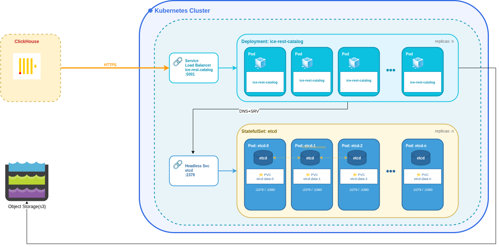

# ICE REST Catalog Architecture

## Components

- **ice-rest-catalog**: Stateless REST API service (Kubernetes Deployment)
- **etcd**: Distributed key-value store for catalog state (Kubernetes StatefulSet)
- **Object Storage**: S3-compatible storage for data files
- **Clients**: ClickHouse or other Iceberg-compatible engines

## Design Principles

### Stateless Catalog

The `ice-rest-catalog` is completely stateless and deployed as a Kubernetes Deployment with multiple replicas. It can be scaled horizontally without coordination. The catalog does not store any state locally—all metadata is persisted in etcd.

### State Management

All catalog state (namespaces, tables, schemas, snapshots, etc.) is maintained in **etcd**, a distributed, consistent key-value store. Each etcd instance runs as a StatefulSet pod with persistent storage, ensuring data durability across restarts.

### Service Discovery

`ice-rest-catalog` uses **DNS+SRV** records to discover and connect to the etcd cluster.
The catalog uses jetcd library to interact with etcd https://github.com/etcd-io/jetcd. 
The etcd cluster can be accessed using dns+srv as it allows dynamic discovery of etcd endpoints without hardcoded addresses.

### High Availability

- Multiple `ice-rest-catalog` replicas behind a load balancer
- etcd cluster.
- Persistent volumes for etcd data
- S3 for durable object storage
