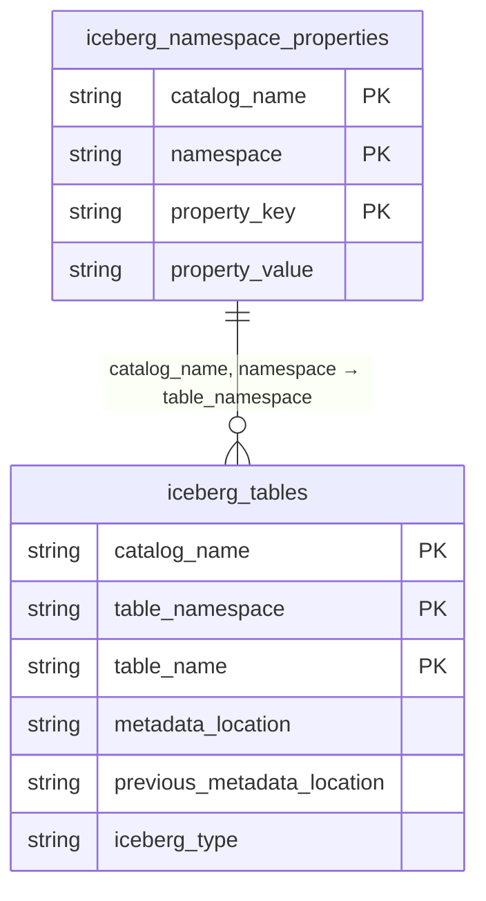

# Iceberg REST Catalog — SQLite Backend Schema

This document describes the SQLite database schema used by the Iceberg REST Catalog to track namespaces and tables.

---

## ERD Diagram

> **Relationship:** `iceberg_namespace_properties.catalog_name` + `namespace` logically maps to `iceberg_tables.catalog_name` + `table_namespace`. A namespace can contain zero or more tables.

---

## Schema

### `iceberg_tables`

Stores metadata references for every registered Iceberg table.

| Column | Key | Description |
|---|---|---|
| `catalog_name` | PK | Catalog identifier (e.g. `default`) |
| `table_namespace` | PK | Dot-separated namespace the table belongs to |
| `table_name` | PK | Name of the table |
| `metadata_location` | | S3 path to the **current** metadata JSON file |
| `previous_metadata_location` | | S3 path to the **previous** metadata JSON file (empty if first version) |
| `iceberg_type` | | Object type — always `TABLE` |

### `iceberg_namespace_properties`

Stores key/value properties for each namespace.

| Column | Key | Description |
|---|---|---|
| `catalog_name` | PK | Catalog identifier |
| `namespace` | PK | Namespace name |
| `property_key` | PK | Property key |
| `property_value` | | Property value |

---

## Sample Data

### `iceberg_tables`

| catalog_name | table_namespace | table_name | metadata_location | previous_metadata_location | iceberg_type |
|---|---|---|---|---|---|
| default | test | ll2 | `s3://bucket1/test/ll2/metadata/00003-bb602d70-...json` | `s3://bucket1/test/ll2/metadata/00002-1debf62b-...json` | TABLE |
| default | test | ll2_p | `s3://bucket1/test/ll2_p/metadata/00001-690b44b8-...json` | `s3://bucket1/test/ll2_p/metadata/00000-d87bf260-...json` | TABLE |
| default | test | ll3_ | `s3://bucket1/test/ll3_/metadata/00001-005c7284-...json` | `s3://bucket1/test/ll3_/metadata/00000-08751e01-...json` | TABLE |
| default | test | type_test | `s3://bucket1/test/type_test/metadata/00003-688d3504-...json` | `s3://bucket1/test/type_test/metadata/00002-2aab973f-...json` | TABLE |
| default | test | type_test2 | `s3://bucket1/test/type_test2/metadata/00000-8573b865-...json` | *(none)* | TABLE |
| default | test | type_test_no_copy | `s3://bucket1/test/type_test_no_copy/metadata/00001-e2ecf4d0-...json` | `s3://bucket1/test/type_test_no_copy/metadata/00000-2e38b5ba-...json` | TABLE |
| default | test | type_test_no_copy_2 | `s3://bucket1/test/type_test_no_copy_2/metadata/00000-90ca965f-...json` | *(none)* | TABLE |
| default | test | type_test_no_copy_3 | `s3://bucket1/test/type_test_no_copy_3/metadata/00001-05050286-...json` | `s3://bucket1/test/type_test_no_copy_3/metadata/00000-a9a4f859-...json` | TABLE |
| default | test | type_test_no_copy_44 | `s3://bucket1/test/type_test_no_copy_44/metadata/00001-5ae8dcb9-...json` | `s3://bucket1/test/type_test_no_copy_44/metadata/00000-01ad9f2d-...json` | TABLE |
| default | test | type_test_no_copy_0 | `s3://bucket1/test/type_test_no_copy_0/metadata/00001-c3aa9443-...json` | `s3://bucket1/test/type_test_no_copy_0/metadata/00000-b64bfb12-...json` | TABLE |
| default | test | type_test_no_copy_02 | `s3://bucket1/test/type_test_no_copy_02/metadata/00000-6c2832c0-...json` | *(none)* | TABLE |
| default | nyc | taxis_p_by_day | `s3://bucket1/nyc/taxis_p_by_day/metadata/00001-dd00d7f3-...json` | `s3://bucket1/nyc/taxis_p_by_day/metadata/00000-afe27a5c-...json` | TABLE |
| default | nyc | simple_table | `s3://bucket1/nyc/simple_table/metadata/00000-0fc867be-...json` | *(none)* | TABLE |
| default | test | simple_table | `s3://bucket1/test/simple_table/metadata/00000-fe34018d-...json` | *(none)* | TABLE |

### `iceberg_namespace_properties`

| catalog_name | namespace | property_key | property_value |
|---|---|---|---|
| default | test.ll2 | exists | true |
| default | nyc | exists | true |

---

## Notes

- The composite primary key for `iceberg_tables` is (`catalog_name`, `table_namespace`, `table_name`).
- The composite primary key for `iceberg_namespace_properties` is (`catalog_name`, `namespace`, `property_key`).
- Tables with an empty `previous_metadata_location` are at their initial version (version 0).
- The metadata version can be inferred from the filename prefix (e.g. `00003-...` = version 3, meaning 3 commits since creation).
- All metadata files are stored in S3 under the pattern: `s3://<bucket>/<namespace>/<table>/metadata/<version>-<uuid>.metadata.json`.
