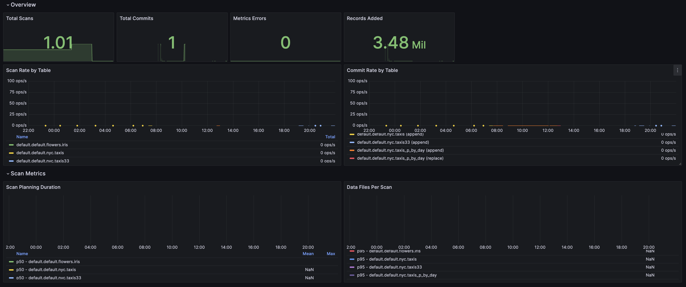
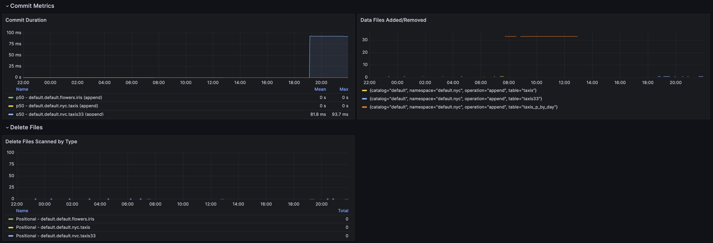
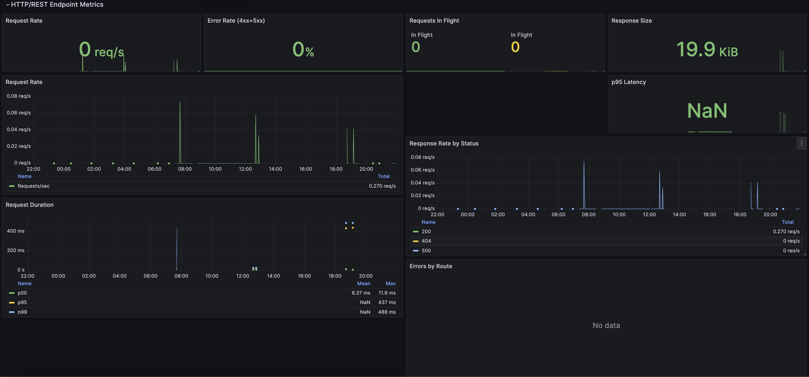
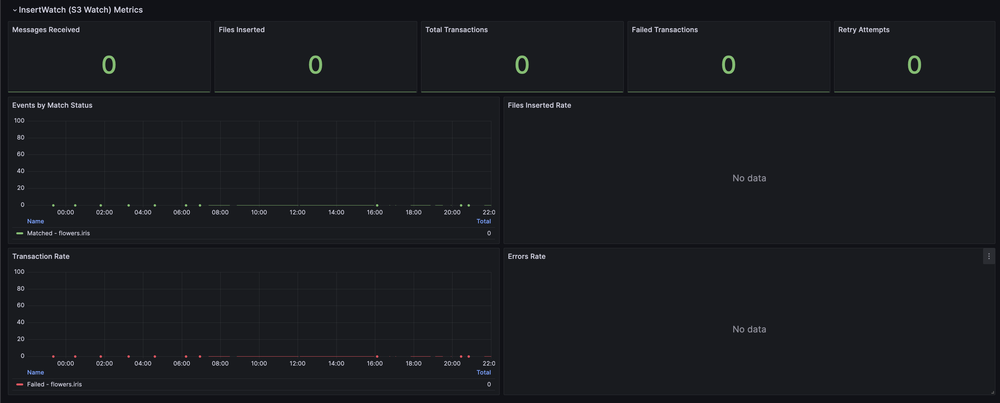
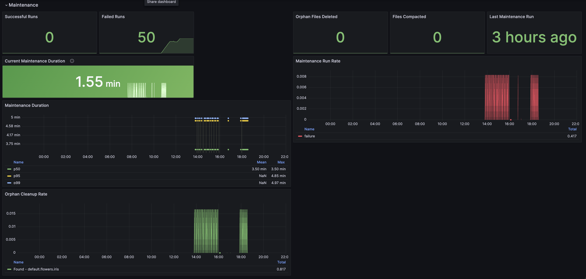

# Iceberg REST Catalog Metrics

This document describes the Prometheus metrics exposed by the Iceberg REST Catalog.

## Dashboard Overview

### Overview & Scan Metrics

### Commit Metrics & Delete Files

### HTTP/REST Endpoint Metrics

### InsertWatch (S3 Watch) Metrics

### Maintenance Metrics

## Metrics Reference

### Iceberg Table Metrics

These metrics are reported by Iceberg clients when they perform operations on tables.

#### Scan Metrics

| Metric Name | Type | Labels | Description |
|-------------|------|--------|-------------|
| `iceberg_scans_total` | Counter | catalog, namespace, table | Total number of Iceberg table scans |
| `iceberg_scan_result_data_files_total` | Counter | catalog, namespace, table | Total number of data files in scan results |
| `iceberg_scan_result_delete_files_total` | Counter | catalog, namespace, table | Total number of delete files in scan results |
| `iceberg_scan_indexed_delete_files_total` | Counter | catalog, namespace, table | Total number of indexed delete files in scan results |
| `iceberg_scan_positional_delete_files_total` | Counter | catalog, namespace, table | Total number of positional delete files in scan results |
| `iceberg_scan_equality_delete_files_total` | Counter | catalog, namespace, table | Total number of equality delete files in scan results |
| `iceberg_scan_total_data_manifests` | Counter | catalog, namespace, table | Total number of data manifests considered during scans |
| `iceberg_scan_total_delete_manifests` | Counter | catalog, namespace, table | Total number of delete manifests considered during scans |
| `iceberg_scan_scanned_data_manifests` | Counter | catalog, namespace, table | Total number of data manifests actually scanned |
| `iceberg_scan_skipped_data_manifests` | Counter | catalog, namespace, table | Total number of data manifests skipped during scans |
| `iceberg_scan_total_file_size_bytes` | Counter | catalog, namespace, table | Total file size in bytes for scanned data files |
| `iceberg_scan_total_delete_file_size_bytes` | Counter | catalog, namespace, table | Total file size in bytes for scanned delete files |
| `iceberg_scan_planning_duration_seconds` | Histogram | catalog, namespace, table | Duration of scan planning in seconds |
| `iceberg_scan_data_files_per_scan` | Histogram | catalog, namespace, table | Distribution of data files per scan |

#### Commit Metrics

| Metric Name | Type | Labels | Description |
|-------------|------|--------|-------------|
| `iceberg_commits_total` | Counter | catalog, namespace, table, operation | Total number of Iceberg table commits |
| `iceberg_commit_added_data_files_total` | Counter | catalog, namespace, table, operation | Total number of data files added in commits |
| `iceberg_commit_removed_data_files_total` | Counter | catalog, namespace, table, operation | Total number of data files removed in commits |
| `iceberg_commit_added_delete_files_total` | Counter | catalog, namespace, table, operation | Total number of delete files added in commits |
| `iceberg_commit_removed_delete_files_total` | Counter | catalog, namespace, table, operation | Total number of delete files removed in commits |
| `iceberg_commit_added_records_total` | Counter | catalog, namespace, table, operation | Total number of records added in commits |
| `iceberg_commit_removed_records_total` | Counter | catalog, namespace, table, operation | Total number of records removed in commits |
| `iceberg_commit_added_equality_deletes_total` | Counter | catalog, namespace, table, operation | Total number of equality deletes added in commits |
| `iceberg_commit_total_files_size_bytes` | Counter | catalog, namespace, table, operation | Total size in bytes of files involved in commits |
| `iceberg_commit_duration_seconds` | Histogram | catalog, namespace, table, operation | Duration of commit operations in seconds |

#### Reporter Metrics

| Metric Name | Type | Labels | Description |
|-------------|------|--------|-------------|
| `iceberg_metrics_reporter_active` | Counter | - | Iceberg metrics reporter status (value 1 means reporter is active) |
| `iceberg_metrics_report_errors_total` | Counter | type | Total number of errors while processing metrics reports |

### HTTP/REST API Metrics

These metrics track HTTP requests to the REST catalog API.

| Metric Name | Type | Labels | Description |
|-------------|------|--------|-------------|
| `iceberg_http_requests_total` | Counter | method, route | Total number of HTTP requests |
| `iceberg_http_responses_total` | Counter | method, route, status_class | Total number of HTTP responses by status class |
| `iceberg_http_request_duration_seconds` | Histogram | method, route | HTTP request duration in seconds |
| `iceberg_http_requests_in_flight` | Gauge | - | Number of HTTP requests currently being processed |
| `iceberg_http_response_size_bytes_total` | Counter | method, route | HTTP response size in bytes |

### InsertWatch (S3 Watch) Metrics

These metrics track S3 event-driven file insertions.

| Metric Name | Type | Labels | Description |
|-------------|------|--------|-------------|
| `ice_watch_messages_received_total` | Counter | table, queue, instance | Total SQS messages received |
| `ice_watch_files_inserted_total` | Counter | table, queue, instance | Total files inserted from S3 events |
| `ice_watch_transactions_total` | Counter | table, queue, instance | Total insert transactions committed |
| `ice_watch_transactions_failed_total` | Counter | table, queue, instance | Total failed transactions |
| `ice_watch_retry_attempts_total` | Counter | table, queue, instance | Total retry attempts |
| `ice_watch_events_by_status_total` | Counter | table, queue, instance, status | Events by match status (matched/unmatched) |

### Maintenance Metrics

These metrics track background maintenance operations.

| Metric Name | Type | Labels | Description |
|-------------|------|--------|-------------|
| `ice_maintenance_runs_total` | Counter | status | Total number of maintenance runs |
| `ice_maintenance_duration_seconds` | Histogram | - | Duration of maintenance run in seconds |
| `ice_maintenance_in_progress` | Gauge | - | Whether maintenance is currently running (1 = running, 0 = idle) |
| `ice_maintenance_last_run_timestamp` | Gauge | - | Unix timestamp of the last maintenance run |
| `ice_maintenance_start_timestamp` | Gauge | - | Unix timestamp when current maintenance started |
| `ice_maintenance_skipped_total` | Counter | - | Times maintenance was skipped (already in maintenance mode) |
| `ice_maintenance_orphan_files_found_total` | Counter | table | Total orphaned files discovered |
| `ice_maintenance_orphan_files_deleted_total` | Counter | table | Total orphaned files successfully deleted |
| `ice_maintenance_orphan_files_excluded_total` | Counter | table | Files excluded by whitelist |
| `ice_maintenance_orphan_delete_failures_total` | Counter | table | Files that failed to delete |
| `ice_maintenance_compaction_files_merged_total` | Counter | table | Total input files merged during compaction |
| `ice_maintenance_compaction_output_files_total` | Counter | table | Total output files produced after merge |
| `ice_maintenance_compaction_bytes_read_total` | Counter | table | Total bytes read during compaction |
| `ice_maintenance_compaction_bytes_written_total` | Counter | table | Total bytes written during compaction |

## Label Descriptions

| Label | Description |
|-------|-------------|
| `catalog` | Catalog name (default: "default") |
| `namespace` | Namespace/schema name (e.g., "db.schema") |
| `table` | Table name |
| `operation` | Commit operation type (e.g., "append", "replace", "overwrite") |
| `method` | HTTP method (GET, POST, DELETE, etc.) |
| `route` | REST API route name (e.g., LIST_NAMESPACES, LOAD_TABLE) |
| `status_class` | HTTP status code class (200, 400, 404, 500, etc.) |
| `status` | Maintenance run status (success, failure) or event match status |
| `type` | Error type for metrics report errors |
| `queue` | SQS queue name for InsertWatch |
| `instance` | Instance identifier for InsertWatch |

## Grafana Dashboard

Import the dashboard from `iceberg-metrics-dashboard.json` in this directory.

